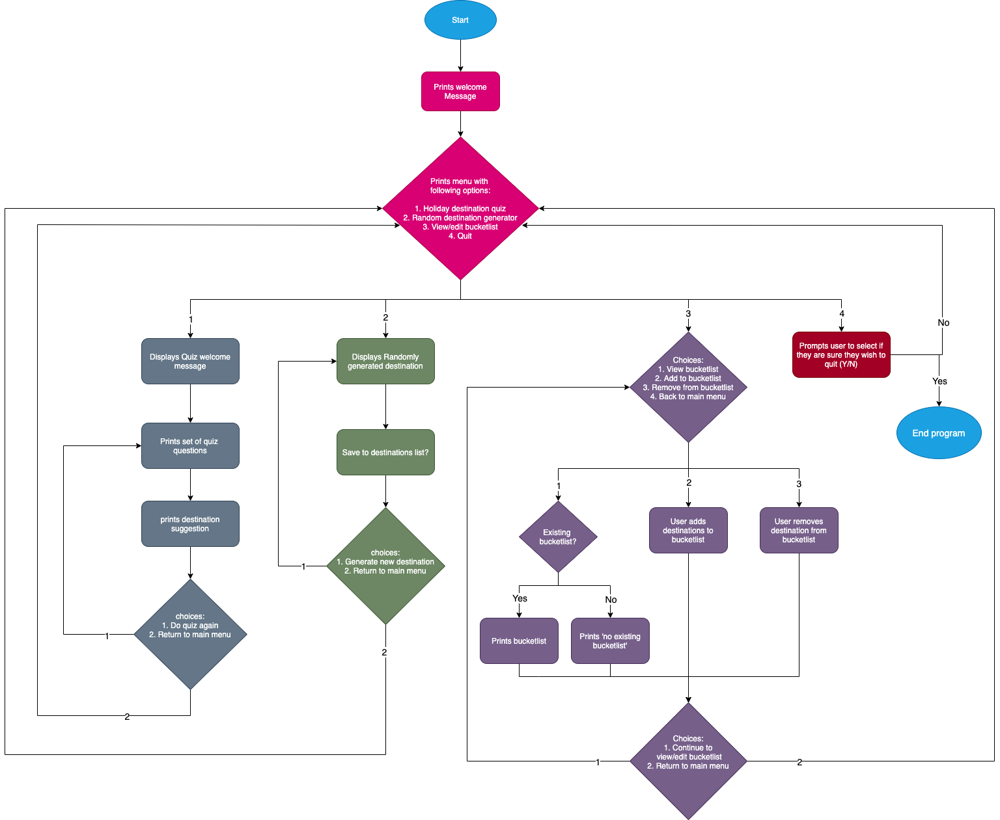
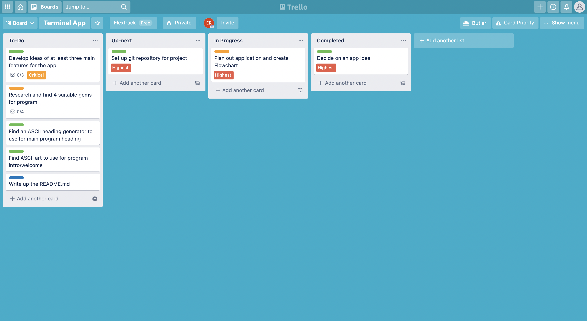
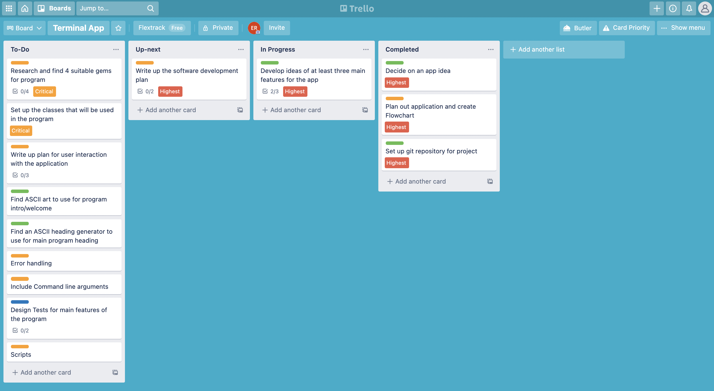
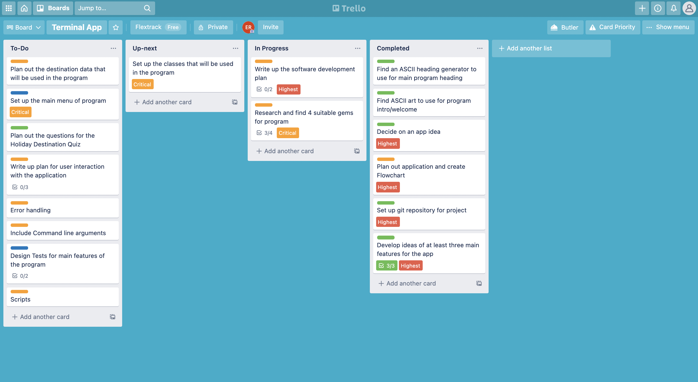
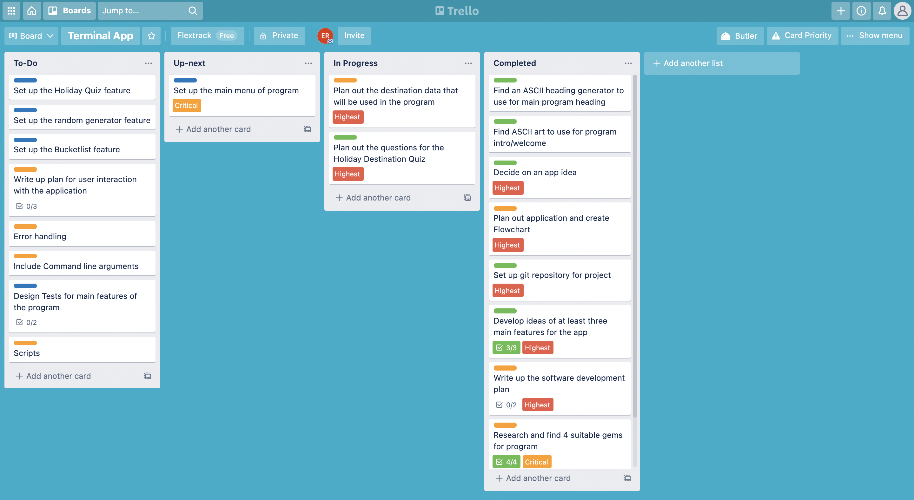
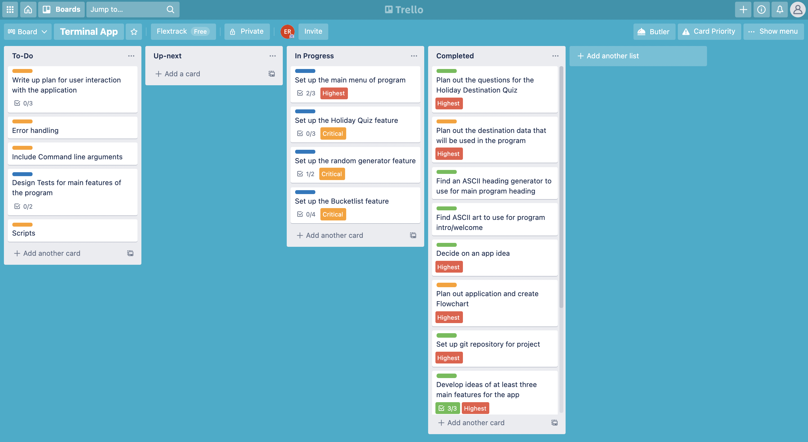
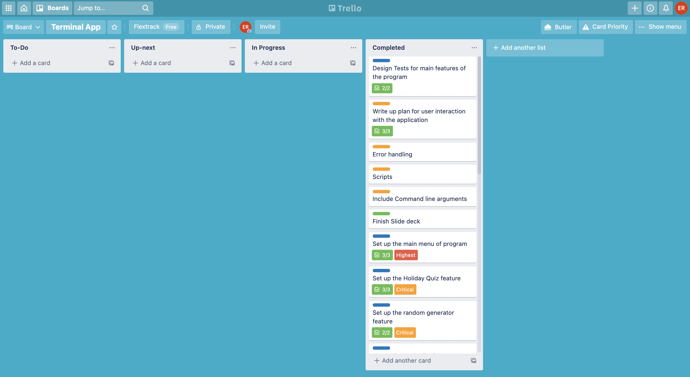

# HolidayHelper: Ruby Terminal App

**GitHub Repository:**
<https://github.com/EllieRamanlal/terminal-app>

## Purpose and Scope

**What HolidayHelper will do**

HolidayHelper is an application that is designed to provide users with inspiration for their next holiday. HolidayHelper does this in three main ways. Firstly, through a holiday destination quiz, whereby users can answer questions regarding their holiday preferences, and HolidayHelper will provide a destination recommendation based on these preferences. Secondly, through a random destination generator, which provides users with randomly generated destinations to consider for their next holiday. And thirdly, through a bucket list tracker, which allows users to maintain inspiration for their next trip by logging their dream destinations. 

With a lack of recent travel due to travel bans, many have lost the enjoyment and excitement that comes with planning a holiday. However, HolidayHelper aims to provide entertainment by reigniting that holiday-planning joy, and providing users with exciting destination recommendations for their next trip.

**Target audience**

The target audience of this app will be individuals who are seeking inspiration for their next holiday, or those who simply want a form of entertainment to distract from the lack of current travel. As this app is run from the command line, it is also best suited to users who have some kind of coding ability.

**How the target audience will use HolidayHelper**

A target audience member will be able to follow instructions in the README to install the requirements to run HolidayHelper. Users will then run the HolidayHelper application from the command line. The needs of the target audience member will determine how they choose to use the app and what features they will use. Members of the target audience that are looking for a recommendation for their next holiday destination can navigate their way through the holiday quiz feature of the app, whereas users looking for a more spontaneous destination recommendation can use the random destination generation. Whilst using the app, target audience members can utilize the bucketlist feature in order to keep track of these recommendations.

## Features

HolidayHelper includes three main features, which are all accessible from the HolidayHelper main menu:

**Holiday Destination Quiz**

This feature allows users to answer a set of questions, to then receive a recommended holiday destination based on their choices. The user will first be prompted to answer two questions, which are formatted using tty-prompt – allowing the user to navigate between the answer options by simply using their arrow keys. When both quiz questions have been answered, a loading bar is displayed (using tty-progressbar) while the program fetches a recommended destination based on the user’s input. Destinations will be stored in various arrays, according to what category they fall into. Depending on what options the user has selected for each question, the program will then output an element that is common to the arrays of the categories selected. Upon receiving their recommendation, the user will be provided with two menu options – to either do the quiz again, or return back to the main menu.

**Random Destination Generator**

This feature allows the user to receive a randomly generated destination. This feature first displays a message that the program is “fetching a random destination” whilst also displaying a progress bar. For this feature, a set of various destinations will be stored in an array, and one destination will be randomly selected using the .sample method, and this destination is the printed to the screen. After  receiving their randomly generated destination, the user will be provided with two menu options – to either generate another random destination, or return back to the main menu.

**Bucketlist**

This feature allows the user to maintain a bucket list of holiday destinations. Once navigating to this feature, users will be provide with a menu with three options – to view their bucketlist, to add a destination to their bucketlist, or to remove a destination from their bucketlist. If the user chooses to view their bucketlist, the program will print their logged destinations to the screen (and if they haven’t already created a bucketlist, the program will create a txt file for the user which they can then add to). If the user chooses to either add or remove to/from their bucket list, they will be prompted to type in a destination (or its number on the bucketlist), and HolidayHelper will add/remove this from their bucketlist file. After this process, the user will be provided with a menu with two options – to continue to view/edit their bucketlist or to return back to the main menu. 

## User interaction and experience

**How the user will find out how to interact with each feature**

Instructions regarding the installation and running of the application will all be available to the user in the README file. Once the user has accessed the program, their interaction with HolidayHelper will be led by the instructions and prompts delivered by the program. All instructions required to appropriately navigate the program will be printed to the screen, making it easy for the user to properly use the program at all stages. 

**How the user will interact with each feature**

The user will be able to access all three of the main features HolidayHelper via the main program menu. Once they have selected a feature, they can go through the process of using that feature (all instructions involved with these features will be clearly communicated to the user). Once they have finished using a feature, they will be displayed with a menu with two options: to either use the feature again, or navigate back to the main menu. Once navigating back to the main menu, the user can access the program’s other main features. The majority of the program also employs the use of TTY-prompt, which makes it extremely simple for users to navigate menus and answer questions (the use of multiple choice questions using TTY-prompt also prevents many errors that may occur with requiring user input).

**How errors will be handled/displayed to the user**

The application has been designed to handle both ArgumentErrors and StandardErrors in the main program loop. In the event of an ArgumentError, the user will be displayed with the message “An Argument error seems to have occurred – please try again”. In the event of a StandardError, the user will be displayed with the message “An error seems to have occurred – please try again”

## Installation

**System Requirements**
Holiday Helper uses Ruby version 2.7.2 and Bundler version 2.2.17

**Instructions for installation**

Please follow the below instructions in order to run HolidayHelper

1. Clone this repository to your local machine by running the following command

        git clone https://github.com/EllieRamanlal/portfolio.git

2. `cd` into the `/terminal-app/src` folder and run the following command in order to install all the requirements to run HolidayHelper (Homebrew, Ruby, Bundler, and any gem dependancies)

        ./install.sh

3. HolidayHelper can then be run using the following command

        ./run_app.sh

**Command line arguments for HolidayHelper**
`-h` for program information and help
`-v` for ruby version information

**Gem Dependencies**
•	Artii
•	Colorize
•	TTY-promt
•	TTY-progressbar

## Testing

Please follow the below link to access the Google Sheet for the manual testing I completed for HolidayHelper:

<https://docs.google.com/spreadsheets/d/1itFpIDG5hxCjK_B_LWea6ZD0tAFNTNWO3RDYK1_VjUU/edit?usp=sharing>

## Control Flow Diagram

## Project Management
For the project management of this assignment, I employed the use of a trello board. I broke tha assigment down into a range of smaller, more manageable tasks and added these to my trello board, then used checklists to further break these tasks down and track the progress of each task. In order to manage my time, I used coloured labels to indicate the size of a task (green, orange and blue), and I additionally assigned tasked priority labels. Please see the below screenshots of the progress of my trello board throughout the assignment. 

**Trello progress 1/6**

**Trello progress 2/6**

**Trello progress 3/6**

**Trello progress 4/6**

**Trello progress 5/6**

**Trello progress 6/6**

